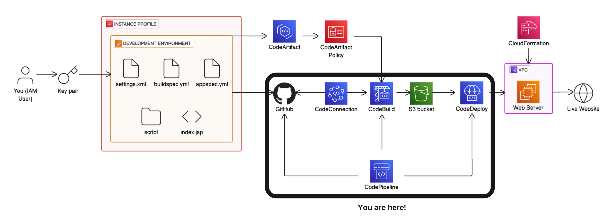

NextWork DevOps CI/CD Project

This project demonstrates a full CI/CD pipeline on AWS that automatically builds and deploys a Java web application whenever changes are pushed to GitHub.

📋 Overview

I built and deployed a simple Java web app using AWS Developer Tools.
The pipeline integrates GitHub → CodeBuild → CodeDeploy → EC2, with an S3 artifact store and IAM roles for security.

🏗️ Architecture

GitHub  ──>  CodePipeline ──>  CodeBuild ──>  CodeDeploy ──>  EC2
                       │
                       └─> S3 Artifact Bucket

GitHub – Source repository that triggers the pipeline on every push to master.

CodePipeline – Orchestrates the CI/CD workflow.

CodeBuild – Compiles and packages the Maven Java web application.

CodeDeploy – Deploys the built artifact to the running EC2 instance.

EC2 – Hosts the Tomcat-based web application.

S3 – Stores build artifacts.

IAM – Provides least-privilege roles for each service.

🛠️ Step-by-Step Implementation
1. Launch EC2 and Install Application Stack

Region: us-east-1

Amazon Linux 2 t2.micro

Installed Java 17 and Maven.

Configured Tomcat for Java web app hosting.

2. Initialize GitHub Repository

Created a private GitHub repo nextwork-web-project.

Added a basic index.jsp inside src/main/webapp/.

Connected EC2 instance to GitHub using SSH and Personal Access Token.

3. Configure AWS CodePipeline

Pipeline name: nextwork-devops-cicd

Execution mode: Superceded

Source: GitHub (via CodeConnections App)

Build: CodeBuild project using a buildspec.yml to run mvn package.

Deploy: CodeDeploy application + deployment group targeting the EC2 instance.

4. Test Continuous Deployment

Edited index.jsp and pushed to the master branch.

Pipeline triggered automatically:

Source → Build → Deploy all turned green.

Accessed EC2 Public DNS to confirm the change appeared live.

5. Rollback Drill

Performed a manual rollback from the CodePipeline console to the previous successful revision.

Verified the web app reverted to the earlier version—demonstrating disaster-recovery capability.

6. Export Infrastructure as Code

Used CloudFormation Stack Import (via AWS Console “Create template from existing resources”) to scan all resources (EC2, S3, CodePipeline, CodeBuild, CodeDeploy, IAM roles).

Generated infrastructure/nextwork-devops.yaml template so the entire setup can be redeployed with a single command.

aws cloudformation deploy \
  --template-file infrastructure/nextwork-devops.yaml \
  --stack-name nextwork-devops \
  --capabilities CAPABILITY_NAMED_IAM

Adjust parameters such as key pair or GitHub connection ARN as needed.
🧹 Cleanup

To avoid costs, I deleted all AWS resources after testing:

    CodePipeline, CodeBuild, CodeDeploy application & deployment group

    S3 artifact bucket

    EC2 instance & key pair

    IAM roles and policies

    CloudFormation stack (if deployed)

📂 Repository Structure

.
├── src/main/webapp/index.jsp      # Java web application
├── buildspec.yml                  # Build instructions for CodeBuild
├── appspec.yml                    # Deployment instructions for CodeDeploy
└── infrastructure/
    ├── nextwork-devops.yaml       # Exported CloudFormation template
    └── README.md                  # Template usage instructions

✨ Key Takeaways

End-to-end AWS DevOps workflow using managed services.

Fully automated builds and deployments on every git push.

Hands-on disaster recovery with CodeDeploy rollback.

Infrastructure captured as CloudFormation, enabling repeatable deployments.

Author

Folarin Favour Olaoluwapo
Full-stack Developer | AWS Cloud & DevOps Engineer

Next Steps

You can fork this repository and adapt the template to your own applications to instantly spin up a production-ready CI/CD pipeline.

License

MIT